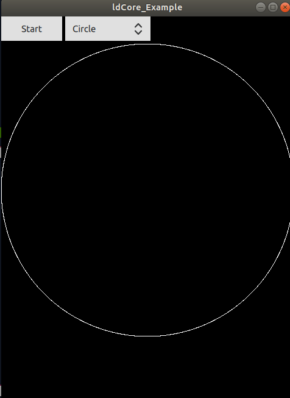

# libLaserdockCore
cmake repository for laserdock library


This repository support multiple OS, however, this focuses on Ubuntu 18.04. For original repo, see: https://github.com/Wickedlasers/libLaserdockCore


## Prequesites 

1. ROS 18.04 
2. Qt5 >= 5.15 : https://www.qt.io/download-qt-installer

## Making it work on ubuntu 18.04

1. `mkdir ~/laser_ws && cd ~/laser_ws && mkdir src && cd src && git clone git@gitlab.com:chironix/robotics/liblaserdockcore.git`
2. `cd ~/laser_ws && catkin build`

```
Errors     << ldCore:install /home/thibault/laser_ws/logs/ldCore/build.install.008.log
make: *** No rule to make target 'install'.  Stop.
cd /home/thibault/laser_ws/build/ldCore; catkin build --get-env ldCore | catkin env -si  /usr/bin/make install; cd -
............................................................................
Failed     << ldCore:install        [ Exited with code 2 ]                  
Failed    <<< ldCore                [ 0.2 seconds ]                         
[build] Summary: 0 of 1 packages succeeded.                                 
[build]   Ignored:   None.                                                  
[build]   Warnings:  None.                                                  
[build]   Abandoned: None.                                                  
[build]   Failed:    1 packages failed.                                     
[build] Runtime: 0.3 seconds total.   

```
This is because there are no `install` targets however it should still have built.

3. `cd ~/laser_ws/build/ldCore/example`
4. `./ldCore_Example`



If start is greyed out, the laser is not connected or `udev` rules are not set correctly

### Setting udev rule 
1.
```
touch /etc/udev/rules.d/51-lasercube.rules && echo -e "SUBSYSTEMS=="usb", ATTRS{idVendor}=="1fc9", ATTRS{idProduct}=="04d8", MODE="0777"
" >> /etc/udev/rules.d/51-lasercube.rules
```

2. `sudo udevadm control --reload-rules && sudo udevadm trigger`

3. Unplug and plug the device and start the example again.